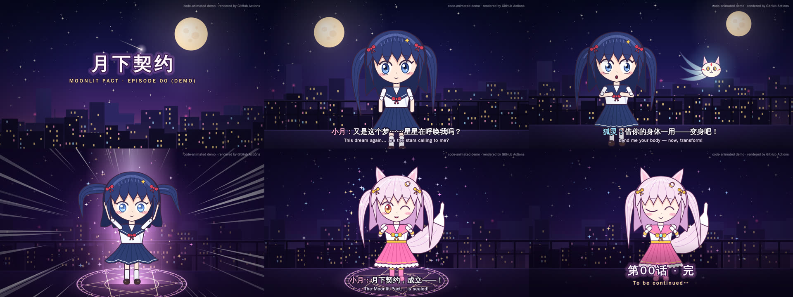

# Ai-Vtuber · code-animated 2D episodes

Write a storyboard in YAML. Code turns it into an anime-style MP4 with dialogue subtitles, a soundtrack and sound effects. GitHub Actions renders the video on every push.



The demo episode, `episodes/ep00_demo.yaml` (月下契约 · Moonlit Pact), runs 25 seconds. A fox spirit finds a schoolgirl on a rooftop at night and possesses her, and she transforms into a magical girl.

## How it works

| Layer | What it does |
|---|---|
| `episodes/*.yaml` | The storyboard: shots, durations, dialogue (Chinese and English), expressions, sound effects |
| `animation/character.py` | A puppet rig drawn as vector shapes: blinking, lip flaps, hair and skirt physics, poses, and the outfit and palette swap for the possessed form |
| `animation/scenery.py` | Night sky, parallax city, rooftop, magic circle, light pillar, sparkles, speed lines (集中線) |
| `animation/shots.py` | Shot templates (camera moves, staging, effect timing) that the storyboard picks by name |
| `animation/audio.py` | Synthesised music-box backing track, sound effects and voice blips |
| `animation/render.py` | Draws every frame with cairo and pipes the frames to ffmpeg to produce H.264/AAC MP4 |

Characters move "on twos" (12 drawings per second), as in TV anime, while the camera and effects update every frame at 24 fps.

## Make your own episode

1. Copy `episodes/ep00_demo.yaml` and change the dialogue, timings, expressions or sound effects.
2. Push. The **Render animation** workflow renders every file in `episodes/`. Download the MP4 from the run's **Artifacts** section.
   You can also start it by hand from **Actions → Render animation → Run workflow**. Use scale `1.5` for 1080p.

New kinds of shot, such as a new location, character or effect, need a new function in `animation/shots.py`.

## Run locally

```bash
sudo apt-get install ffmpeg fonts-wqy-zenhei libcairo2-dev pkg-config   # macOS: brew install ffmpeg cairo pkg-config
pip install -r requirements.txt
python -m animation.render episodes/ep00_demo.yaml                     # -> output/ep00_demo.mp4
python -m animation.render episodes/ep00_demo.yaml --stills 6.5,21.5   # PNG frames, for quick checks
```

A 720p render of the demo takes about 30 seconds on a laptop CPU. It needs no GPU and no API keys.

## Compared with AI-generated anime

Videos from Bilibili's updream platform get their artwork from image and video generation models running on GPUs. This repo draws everything with code instead, which has some consequences:

- Every frame can be reproduced exactly, so characters always stay on-model.
- Rendering is free, and GitHub's free runners are enough to do it.
- The look is limited to what the rig and the shot templates can draw. A new character or location takes code, not a prompt.

The two approaches can be combined. GitHub Actions can call a hosted image or video model for backgrounds or key shots, keeping the key in repository secrets. This renderer then adds the characters, subtitles, sound and editing on top.
